  

  
  
  

---

### 👨‍💻 About Me

AI Engineer passionate about building production-grade intelligent products powered by **LLMs**, **RAG**, **Computer Vision**, and **Autonomous Agents**. Skilled in integrating AI into full-stack applications and deploying robust solutions using modern cloud and DevOps technologies.

---

### 🏆 GitHub Trophies

  

---

### 💻 Technical Skills

#### 🧠 AI & Generative AI

  
  
  
  
  
  
  
  

#### ☁️ Cloud, MLOps & DevOps

  
  
  
  
  
  
  
  
  

#### ⚙️ Backend & Data Engineering

  
  
  
  
  
  
  
  

#### 💻 Programming Languages

  
  
  
  

---

### 📊 GitHub Activity & Statistics

  <table border="0">
    <tr>
      <td>
        
      </td>
      <td>
        
      </td>
    </tr>
    <tr>
      <td colspan="2" align="center">
        
      </td>
    </tr>
  </table>

